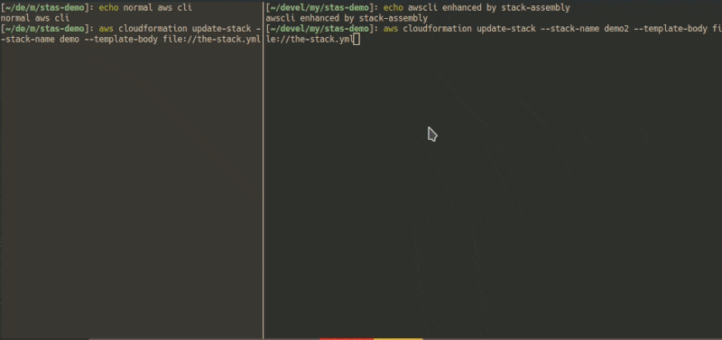

Enhancement of built-in cloudformation commands provided by awscli
==================================================================

Stack-assembly provides a possibility to enhance
[aws-cli](https://github.com/aws/aws-cli) by replacing
[create-stack](https://docs.aws.amazon.com/cli/latest/reference/cloudformation/create-stack.html),
[update-stack](https://docs.aws.amazon.com/cli/latest/reference/cloudformation/update-stack.html)
and
[deploy](https://docs.aws.amazon.com/cli/latest/reference/cloudformation/deploy.html) commands with improved versions of those commands. The improved versions of these commands:
- use change sets
- present changes and give ability to approve/disapprove deployment
- give possibility to view diff of the template to be deployed
- display cloudformation events while stack is being deployed

## Motivation

Most organisations have a lot of deployment scripts that use pure aws-cli. It's
hardly possible to replace usage of aws-cli with tool like stack-assembly in all
those deployment scripts. Therefore stack-assembly provides a wrapper over
aws-cli that enables one to keep using old deployment scripts but still have
some nice features provided by stack-assembly.



## Installation

* Download binaries archive from Releases page.
* Put `stas` and `aws` executables into a folder located under your home
  directory that is added to the `$PATH`.

For example given that `~/bin` folder is added to the `$PATH`, then the
installation might look like this:

```bash
install_dir="$HOME/bin"
cd /tmp
wget -qO- "https://github.com/molecule-man/stack-assembly/releases/download/v0.4.0/stas_0.4.0_linux_amd64.tar.gz" | tar xvz
mv stas $install_dir
mv scripts/aws $install_dir
```
